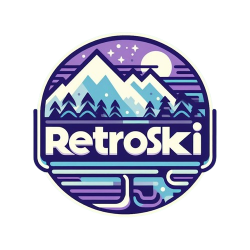

  

# ❄️ Retro Ski game
Welcome on a small game dev project. 
Put your skis and let's race some randomly generated alpine ski tracks with your friends.

## 💻 Demo
https://mathieuher.github.io/RetroSki

## 🎮 Controls
### During the race
* <b>Arrow up</b> (1x) -> Start skiing
* <b>Arrow left</b> -> Left carving
* <b>Arrow right</b> -> Right carving
* <b>Space bar</b> -> Braking/Side sliding

* <b>G</b> -> Enable/Disable Ghost mode (best times)

* <b>R</b>/<b>Escape</b> -> Go back to event menu (allow to restart the race)
* <b>D</b> -> Toggle debug mode

### Event manager
* <b>Escape</b> -> Leave the event and go back to event setup

## 📘 Gamer guide
### Event setup
Welcome to your event setup. 
Here you have to provide few informations before starting to ride :
1. Name of the track (if the track doesn't exist it generates a new one) 
<b>Note: Check one of the preloaded tracks below for your first ride</b>
2. Style of the track (Slalom, Giant slalom, Super-G or Downhill) 
<b>Note: This param is only applied when generating a new track.</b>
3. Name of the first player
4. Name of the second player (must be different than the first player)
5. Number of races (1 to 10 is recommended)
### Event manager
This screen is the home place before and after each race. 
It provides informations about the current event.
### Race
You made it to the top of the hill ! 
Now it's time to have fun and enjoy some nice carving !  
Press <b>Arrow UP</b> (1x) to start skiing and see you at the finish line ! 
Don't miss a gate or you'll receive a penalty of <b>3 seconds</b>

## 💡 Tips
### Preloaded tracks
By default the game provides 5 tracks, so you can use the same track as your friends even on a different setup.
1. Davos (Giant slalom)
2. Adelboden (Slalom)
3. Soelden (Giant slalom)
4. Wengen (Super-G)
5. Zermatt (Downhill)

### Different track styles
Each track style follow is own rule when generating a new track. 
The dynamic of the skier is also impacted by the style of the track to mimic real world differences. 
<b>Note: For your first rides, Giant slalom is a good style to start gaining some experience</b>

### Keep your records
RetroSki use localStorage to persist generated tracks and records.  
You can easily export them and share them with friends by using the browser developper tools.

### Follow your path
By default ghost mode is activated and you can see your best times while racing 
1. 👻 Global record ghost (Fuchsia) -> The all time best registered on the track
2. 👻 Event record ghost (Green) -> The best time registered on the track during this event 

Press the letter <b>G</b> during the race to show/hide the ghosts

## 👷‍♂️ What's next ?
<a href="roadmap.md">Draft of a roadmap</a>

## ⚫ Developer guide
1. Run `npm install` to install dependencies
2. Run `npm run dev` to start the Vite server!
3. Have fun!
