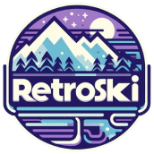

  

# ❄️ **RetroSki** – A thrilling retro 2D skiing adventure! 🎿  
Welcome to **RetroSki**, a small but exciting game where you can carve down randomly generated alpine ski tracks with your friends! Put on your skis, feel the rush of the slopes, and race to victory!

## 💻 **Play the official game**  
Hop on the slopes now!  
<a href="https://retro-ski.ch">retro-ski.ch</a>

## 🎮 **Controls – Master Your Ride!**  
| **Action**           | **⌨️ Keyboard**         | **🎮 Gamepad (recommended)**          | **📱 Touch device**     |
|----------------------|-------------------------|------------------------|------------------------|
| **Start riding (1x)** |  |  | Touch the screen       |
| **Carve**             |   |  | Touch left/right       |
| **Brake / slide**    |  |  | Touch bottom           |
| **Leave the race**   |  |  |                        |
| **Toggle ghosts**    |  |  |                        |
| **Toggle debug mode**|  |                        |                        |

## 📘 **Gamer's Guide – Conquer the Slopes!**

### **Ride Local**  
Create your own race tracks and challenge your friends locally!  
Just follow these simple steps:  
1. Choose a track or create a new one.  
2. Add your rider names.  
3. Select the number of races (from 1 to 10).  

### **Ride Online**  
Race against friends and other players online.  
1. Set up your server or join one.  
2. Race, compete, and share your records with the world.  

### **Race – It’s Time to Shred!**  
You’re at the top of the hill, ready to carve your way to the finish line.  
Press (1x) ⌨️, 🎮, or 📱touch to start skiing.  
⚠️ Don’t miss any gates or face a penalty of **3 seconds**!

### **Game Setup**  
Click the ⚙️ icon on the top right to access your game settings!  
Here, you can adjust a few options for your race:  
- 🔊 Sounds  
- 🧑‍🤝‍🧑 Spectators  
- 👻 Ghosts  
- 🫧 Particles (might affect performance)  
- 🌲 Decorations  

You can also reset everything back to default settings to restore tracks, ghosts, and records.

## 💡 **Tips for Mastering the Slopes!**

### **Different Track Styles**  
Each track type follows unique rules when generating new slopes, mimicking real-world conditions.  
**Pro Tip:** Giant slalom tracks are perfect for beginners to hone their skills!

### **Keep Your Records**  
#### **Local**  
Retro-Ski stores your local records and tracks using localStorage and IndexedDB.  
#### **Online**  
Online records, ghosts, tracks, and events are saved on our servers for you to track your progress.

### **Follow Your Path**  
Ghost mode lets you race against your best times or the best global or event records!  
<table>
  <tr>
    <th>Ghost</th>
    <th>Description</th>
  </tr>
  <tr>
    <td></td>
    <td>Global best time on the track</td>
  </tr>
  <tr>
    <td></td>
    <td>Event best time on the track</td>
  </tr>
</table>

### **Performance Tips**  
Retro-Ski is optimized to run smoothly on any modern device with an up-to-date browser.  
If you experience lag, try refreshing the game.  
For better performance, consider disabling particles and other heavy game objects in the settings.

### **Crash Recovery**  
In case of a crash, try resetting the game via the settings menu to reload the original content and keep shredding!

## 👷‍♂️ **What’s Next?**  
Check out our **roadmap** to see the exciting features coming soon!  
<a href="roadmap.md">Draft of the roadmap</a>

## ❤️ **Support the Project**  
Enjoying your time on the slopes? Help us keep improving the game!  
Consider supporting the project or upgrading to a premium account. 🙏  
<a href="https://donate.stripe.com/7sIaGu2wO52K9S8aEE">Support the project via Stripe</a>

## ⚫ **Developer Guide**  
1. Run `yarn install` to install dependencies.  
2. Run `yarn start` to start locally and begin your development journey.  
3. And most importantly, **have fun!**
