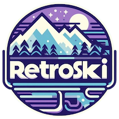

  

# ❄️ Retro Ski game
Welcome to a fun, small game development project!
Put on your skis and race down randomly generated alpine ski tracks with friends.

## 💻 Play the official game
<a href="https://retro-ski.ch">RetroSki</a>

## 🎮 Controls
<table>
  <tr>
    <th>Action</th>
    <th align="left">⌨️ Keyboard</th>
    <th align="left">🎮 Gamepad</th>
    <th align="left">📱 Touch device</th>
  </tr>
  <tr>
    <td>Start riding (1x)</td>
    <td></td>
    <td></td>
    <td>Touch the screen</td>
  </tr>
  <tr>
    <td>Carve</td>
    <td></td>
    <td></td>
    <td>Touch left/right</td>
  </tr>
  <tr>
    <td>Brake / slide</td>
    <td></td>
    <td></td>
    <td>Touch bottom</td>
  </tr>
  <tr>
    <td>Leave the race</td>
    <td></td>
    <td></td>
    <td></td>
  </tr>
  <tr>
    <td>Toggle ghosts</td>
    <td></td>
    <td></td>
    <td></td>
  </tr>
  <tr>
    <td>Toggle debug mode</td>
    <td></td>
    <td></td>
    <td></td>
  </tr>
</table>

## 📘 Gamer guide
### Ride local
Set up your event here! 
Enter a few details to get started: 
1. Choose a track (or create a new one if it doesn’t exist).
2. Enter rider names.
3. Select the number of races (1 to 10).

### Ride online
1. Create or join servers with your friends
2. Ride, compete and share records with them

### Race
You’re at the top of the hill.  
Time to carve some turns! 
Press (1x) ⌨️, 🮠or 📱touch to start skiing and see you at the finish line ! 
⚠️ Don't miss a gate or you'll receive a penalty of <b>3 seconds</b>

### Game setup
You can access to specific game setup by clicking the ⚙️ on the top right in the interface 
Here you can enable or disable few settings for your race:
<ul>
  <li>🔊 Sounds</li>
  <li>🧑‍🤝‍🧑 Spectators</li>
  <li>👻 Ghosts</li>
  <li>🫧 Particles (may affect performance)</li>
  <li>🌲 Decorations</li>
</ul>
You can also reset the game to default settings, restoring all tracks, ghosts, and records.

## 💡 Tips
### Different track styles
Each track style follows unique rules when generating a new track.  
Track style also impacts skier dynamics, mimicking real-world conditions. 
<b>Note:</b> Giant Slalom is a great track style to start gaining experience!

### Keep your records
#### Local
RetroSki uses localStorage and indexedDB to save local generated tracks and records.
#### Online
Online records, ghosts, tracks and events are persisted on servers.

### Follow your path
Ghost mode is activated by default so you can view your best time as you race. 
<table>
  <tr>
    <th>Ghost</th>
    <th>Description</th>
  </tr>
  <tr>
    <td></td>
    <td>Global best time on the track</td>
  </tr>
  <tr>
    <td></td>
    <td>Event best time on the track</td>
  </tr>
</table>

### Performance
RetroSki is designed to run smoothly on any modern device with an updated browser. 
If you encounter performance issues, try reloading the game first. 
For further performance improvements, consider disabling particles and other game objects in the game settings.

### Crash
If the game crashes, try resetting and erasing all content via the game setup menu to reload the original content.

## 👷‍♂️ What's next ?
<a href="roadmap.md">Draft of a roadmap</a>

## ❤️ Support the project
Be sure to enjoy your time on the mountain with us 😃 
Feel free to support the project 🙏 :
<a href="https://donate.stripe.com/7sIaGu2wO52K9S8aEE">Support the project via Stripe</a>

## ⚫ Developer guide
1. Run `yarn install` to install dependencies
2. Run `yarn start` to start in local!
3. Have fun!
